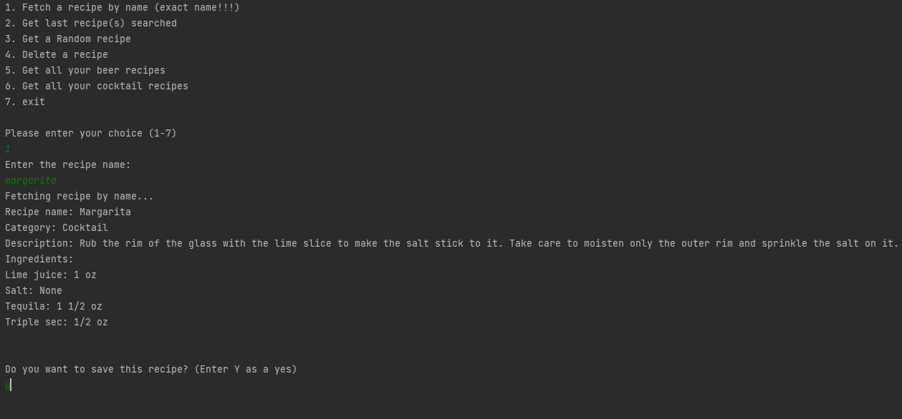
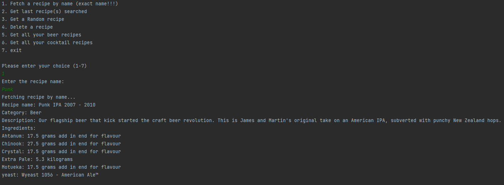

# drinks-recipes-CLI
A CLI for fetching recipes of cocktails and beer recipes, merging them to single format for personal usage and bartenders using flask as a server and used DynamoDB for managing the data.

Beers API: https://github.com/alxiw/punkapi?ref=public_apis&utm_medium=website

All the beers names are in beers.txt

Cocktails API: https://www.thecocktaildb.com/api.php

you can use the cache.json for fetching you 1-5 last searched recipes.

example of usage:

